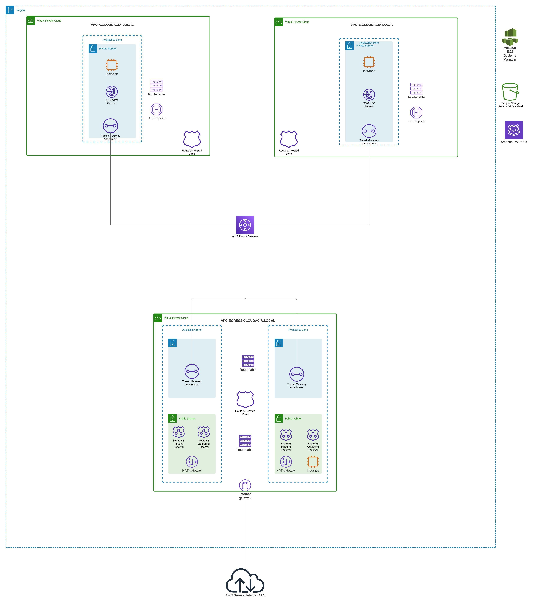

# Transit Gateway with Egress VPC and Route53 Private Hosted Zones

**Built with**

Terraform manages the deployment.

**Requirements**

1. AWS account
2. IAM user with admin privileges
3. Access and secret keys
4. AWS CLI
5. Terraform installed

**AWS resources created**

* 3 x VPC
* 1 x VPC Transit Gateway
* 3 x VPC attachments
* 3 x public subnets
* 4 x private subnets
* 5 x Route table
* 1 x Internet Gateway
* 2 x NAT Gateway
* 3 x EC2
* 2 x SSM Agent installed
* 4 x Security Groups
* 8 x VPC endpoint
* 1 x IAM roles
* 1 x IAM profiles
* 1 x SSH key
* 2 x EIP
* 3 x Private Hosted Zone
* 1 X DNS Inbound resolver
* 1 x DNS Outbound resolver
* 3 x DNS rules

**Getting started**

Deploy the code in your AWS account with Terraform

`terraform init`

`terraform validate`

`terraform plan`

`terraform apply`

`terraform destroy`


**Folder structure options and naming conventions for software projects**
```
.
|-- main.tf                   # AWS provider's configuration
|-- vpc_a.tf                  # VPC, subnet and routing tables
|-- vpc_b.tf                  # VPC, subnet and routing tables
|-- egress_vpc.tf.tf          # VPC, subnet and routing tables
|-- transit_gateway.tf        # TG, TG attachments, tables, and routes
|-- ec2.tf                    # Computing resources
|-- iam.tf                    # instance profiles, roles, IAM policies
|-- security_groups.tf        # Security groups
|-- ssh_keys.tf               # SSH keys
|-- variables.tf              # Variables
|-- dns.tf                    # DNS zones, DNS resolvers, and rules
|-- scripts                   # EC2 initialization scripts
|-- diagram.jpeg              # AWS network layout
|-- LICENSE.txt
|-- README.md
```

**Architecture**



**Contributing**

Contributions are what make the open-source community such an amazing place to learn, inspire, and create. Any contributions you make are greatly appreciated.

If you have a suggestion to improve this, please fork the repo and create a pull request. You can also open an issue with the tag "enhancement".

Don't forget to give the project a star! Thanks again!

**License**

It is distributed under the MIT License. See LICENSE.txt for more information.

**Contact**

Name: Eugenio Duarte

Email: eduarte@cloudacia.com
